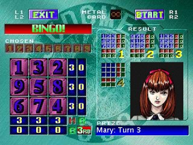

Codebreaker is a game from the arcade in
[Revelations: Persona](https://en.wikipedia.org/wiki/Revelations:_Persona),
similar to [Mastermind](https://en.wikipedia.org/wiki/Mastermind_(board_game))
but played in 2D with numbers instead of colors. The numbers one through nine
appear once each on the board—the goal of the game is to guess the entire board
configuration in at most four tries.

I wrote this applet version of the game in 2003 by screen scraping the graphics
after my wife expressed interest in featuring it on her Persona web site. The
original code was compatible with Java 1.1, though I have bundled the image
resources into a JAR file to improve load time, which is something that Java
1.1 does not directly support.

Here are some brief instructions on how to play the game:

* Click "Start" to begin a new game.
* The arrow keys move the cursor (or click a number to select it).
* Type a number on the keyboard to change the selected grid location to that
  number.
* Click "Check" to see how close your guess is to the actual configuration (or
  use the Enter key).
* The left/upper values (small red numbers) are the number of correctly placed
  numbers for each row and column.
* The right/lower values (small green numbers) are the number of present but
  incorrectly placed numbers for each row and column.
* You can use the Spacebar to "lock in" a number (or use the right mouse
  button).
* You only have four guesses, so choose them carefully.
