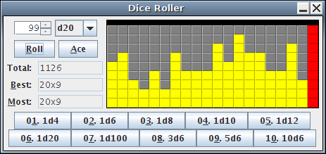

I wrote a compact GUI for doing computerized rolling of polyhedral dice. This
program has been written many times using JavaScript, but less many in Java
Swing—I guess Java is my hammer.

Anyway, the program displays a histogram of all roll results, as well as the
total and other useful statistics. One thing it does not do, however, is keep a
history of results, and as such you may find a simpler but less spiffy-looking
solution such as the [d20 Dice Bag](http://www.d20srd.org/extras/d20dicebag/)
to be more useful.

The "Ace" feature was included for gaming systems such as
[Deadlands](https://en.wikipedia.org/wiki/Deadlands) that have open-ended dice
rolling mechanics. With this mechanic, if any dice roll the maximum value
(e.g., 10 on a d10), reroll them and add the maximum value to the result. If
they roll max again, repeat. So any die can achieve an arbitrarily high result,
but with increasingly infinitesimal probability. I was so interested in this
mechanic, I actually
[wrote some code](files/Deadlands.java) and
[compiled my findings into an Excel spreadsheet](files/Deadlands.xls)
comparing probabilities between various common Deadlands dice combinations.

Back to the Dice Roller, the ten buttons on the bottom are presets for common
dice combinations. Of course, clicking one will roll those dice, but you can
also right click the button to type in your own combination and override the
preset.

Lastly, please bear in mind this warning from the great John Von Neumann:
"Anyone who attempts to generate random numbers by deterministic means is, of
course, living in a state of sin."
