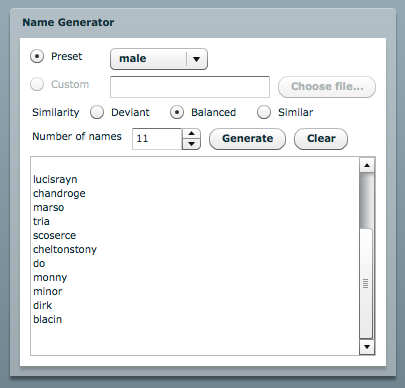

I wrote a [random name generator in Java](../namegen) some time ago. As an
exercise to learn Adobe Flex, I decided to port the application. Most of it
works, but I ran into a couple of problems.

(Note: for an overview of the name generator application, including the
algorithm used, see the [Java version](../namegen)—this writeup focuses on
problems specific to Flex.)

First, Flash doesn't have an API for local file access, so I couldn't allow
user-specified name sources—I assume that's a security consideration. If you
want to access the local filesystem in Java with an applet or with Web Start,
the user has to agree to grant such privileges. It seems there's no way to do
that in Flex. I did find the API to upload files to a server, but that seems
like overkill to solve this problem.

The other big problem I had was embedding the names data into the application.
I figured it would be easy to add them as plain text assets, but apparently
assets are limited to a few types, none of which are simple text. So I had to
wrap each dataset in a gigantic array, and include them in the main
ActionScript file so they would be accessible. I also ran into problems with
the surnames dataset (which has more than 88,000 entries). Attempting to create
a SWF with an 88,000 element array resulted in spectacular failure. I cut down
the dataset to the top 15,000 names and it compiled and ran, but I still had
problems with Firefox crashing when attempting to initialize the application,
even though the SWF was less than 400 KB in size. After trimming the dataset
further to 10,000 names, things seem to work properly.
